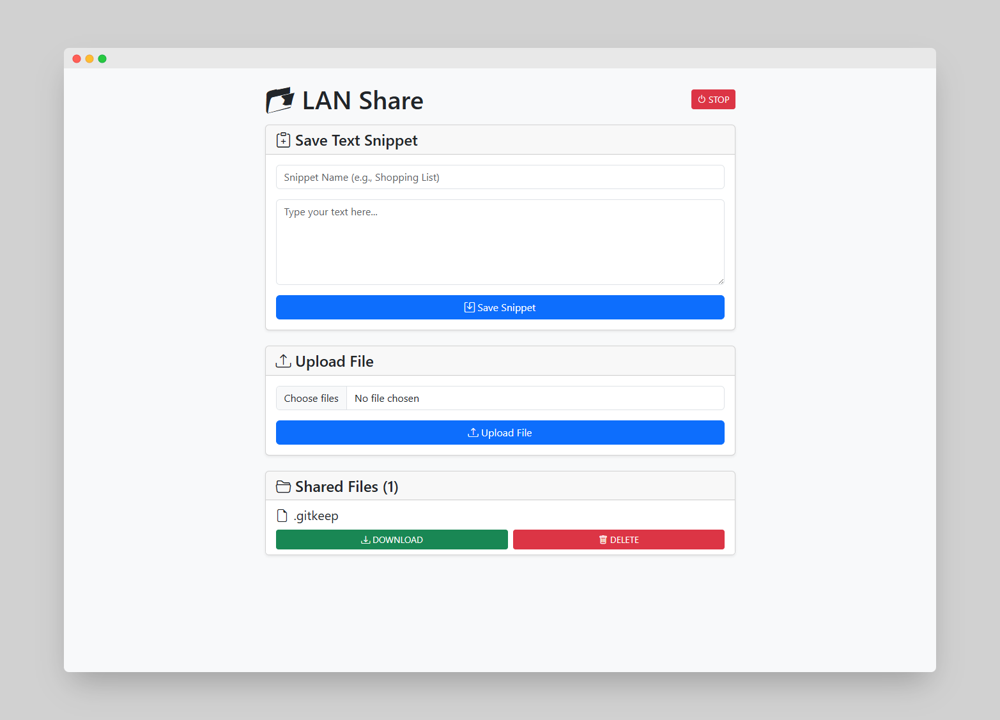

---

# 📂 LAN Share

*A lightweight LAN-based file & text sharing server built with Flask*

LAN Share is a simple, fast, and secure tool that lets you **upload files, view media, share text snippets, download content, and manage files across devices on the same Wi-Fi network**.

Designed for easy use in classrooms, offices, cafés, events, and home networks — without needing internet.

---

## 🚀 Features

### 📝 Save Text Snippets

* Write and save notes directly from the browser
* Stored as `.txt` files inside `shared_files/`
* Preview inside a modal window
* One-click **copy to clipboard**

---

### 📤 Upload Files

* Upload any file: images, videos, documents, audio, ZIPs, etc.
* Multiple file upload supported
* Maximum size: **16 GB** (configurable)

---

### 📂 Shared Files Viewer

Each file shows:

| Action          | Description                                          |
| --------------- | ---------------------------------------------------- |
| **VIEW / PLAY** | Inline preview for images, text, videos, audio, PDFs |
| **DOWNLOAD**    | Save file directly                                   |
| **DELETE**      | Admin-authenticated removal                          |

Files are automatically listed with matching icons:
🖼️ Images • 🎵 Audio • 🎬 Video • 📝 Text • 📦 Archives • 📄 PDFs • 📁 Others

---

### 🔐 Admin-Protected Actions

Some routes require authentication (`admin/admin` by default):

* Delete files
* Stop the server `/shutdown`

Credentials can be changed inside `app.py`.

---

### 📱 Auto QR Code

When the server starts:

* Detects your local IP
* Generates a QR code pointing to your LAN address
* Opens the QR image automatically for mobile access

Perfect for sharing files with phones/tablets.

---

### ⏹ STOP Server Button

A red **STOP** button in the UI triggers `/shutdown`
(admin authentication required).

---

## 🖥️ User Interface Preview

The interface includes:

* Save Snippet panel
* File Upload panel
* Shared Files list with icons & action buttons
* Text preview modal
* STOP button on top right

```
📂 LAN Share
[ STOP ]

📝 Save Text Snippet
📤 Upload File
📁 Shared Files (count)
    VIEW | DOWNLOAD | DELETE
```




---

## 📁 Project Structure

```
LanShare/
│── app.py
│── .gitignore
│── README.md
│── LICENSE
│── requirements.txt
│── start_server.bat
│── stop_server.bat
│
├── shared_files/
│    └── .gitkeep
│
└── templates/
     └── index.html
```

**Note:**
`shared_files/` contains user-uploaded files at runtime
`.gitkeep` ensures the folder exists in GitHub.

---

## ⚙️ Installation

### 1️⃣ Clone the repository

```bash
git clone https://github.com/git-itsjoel/lan-file-share.git
cd lan-file-share
```

### 2️⃣ Install dependencies

```bash
pip install -r requirements.txt
```

---

## ▶️ Run the Server

```bash
python app.py
```

Terminal output example:

```
Server running at: http://192.168.x.x:5000
Admin Username: admin
Admin Password: admin
```

A `connect_qr.png` will open automatically for phone access.

---

## 📲 Connect From Other Devices

Make sure all devices are connected to the **same Wi-Fi / LAN**.

Open in browser:

```
http://<your-local-ip>:5000
```

Or scan the QR code.

---

## 🛡️ Security Notes

⚠️ Not intended for open internet use.

If exposing externally, use:

* Different admin credentials
* HTTPS or reverse proxy
* Firewall restrictions

---

## 📜 License

This project is licensed under the **MIT License**.
(See the `LICENSE` file.)

---

## 🤝 Contributing

Pull requests are welcome!
You can contribute:

* UI improvements
* New features
* Bug fixes
* Documentation updates